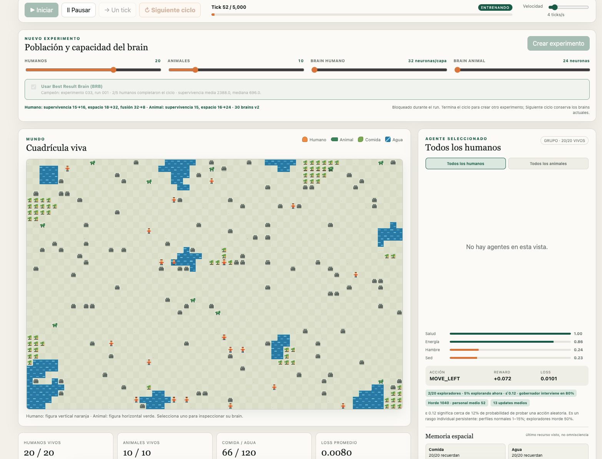
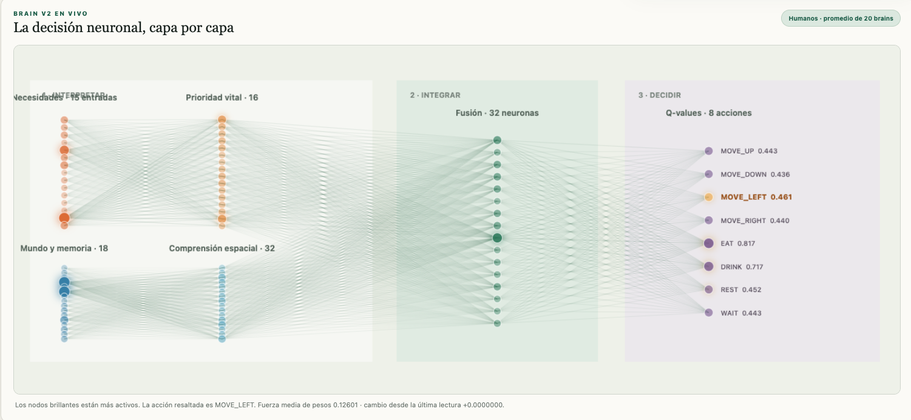
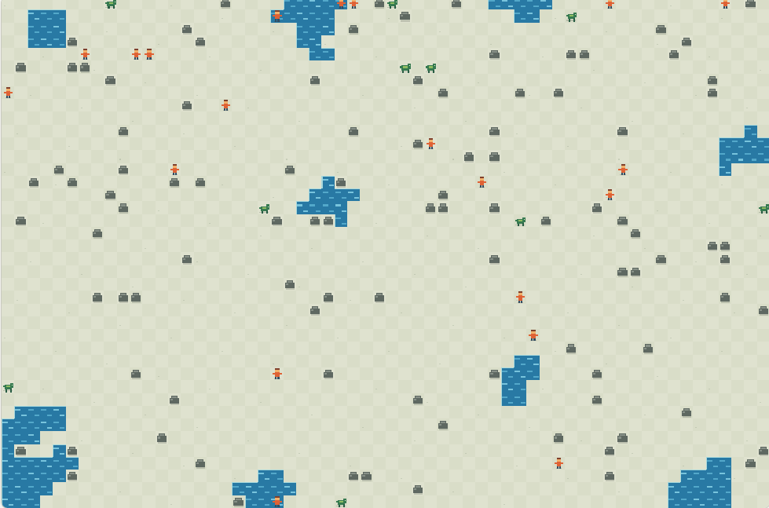

# LifeSim v0.1

[Español](README_es.md)

LifeSim is a grid-based artificial-life simulator and a small laboratory for studying neural networks with PyTorch. Five humans and ten animals try to survive by finding food and water. Every individual owns an independent brain, optimizer, and personal history; model weights are never shared, while Horde-inspired collective replay lets agents learn from experiences gathered by their species.

Version 0.1 focuses on a complete, observable cycle:

```text
WORLD -> PERCEPTION -> BRAIN -> ACTION -> REWARD -> LEARNING -> CHECKPOINT -> NEXT RUN
```

LifeSim is not intended to model realistic biology. It also requires no Docker containers, external servers, accounts, or sidecar processes.

## Screenshots

### Running cycle

The complete web laboratory during an active training cycle, including experiment controls, the living grid, group statistics, and the selected-agent panel.



### Brain v2

The live neural-decision view exposes the need and spatial/social-memory encoders, their fusion layer, all eleven Q-values, and the action selected by the brain.



### Living world

The 60×40 world contains humans, animals, distributed food, clustered water, and obstacles. Agents perceive and act in this same grid during training.



## Requirements and installation

- Python 3.12 or newer
- PyTorch, NumPy, Pandas, and Matplotlib
- pytest for development

Using `venv` and pip:

```bash
python3.12 -m venv .venv
source .venv/bin/activate
pip install -e '.[dev]'
```

Using `uv`:

```bash
uv sync --extra dev
```

## Running LifeSim

### Interactive web laboratory

The recommended way to observe the simulation is:

```bash
python main.py --new --web --seed 42
```

Then open `http://127.0.0.1:8765`. The simulation starts paused so the first ticks are not missed. The interface lets you:

- play, pause, or advance exactly one tick;
- cancel the active experiment, saving a partial checkpoint when it already advanced;
- change the speed from 1 to 30 ticks per second;
- create experiments with 1–30 humans and 1–50 animals;
- adjust human and animal brain widths from 8 to 64 neurons;
- start an experiment from the **Best Result Brain (BRB)**;
- explore a 60×40 Canvas grid rendered internally at 1200×800 for crisp pixel art;
- distinguish F/M humans, prey, predators, babies, and species-specific corpses, with movement, attack, gathering, eating, drinking, and resting animations;
- watch procedural grass, flowers, stones, fruit plants, rippling water, paths, and camps that evolve with stored food;
- view a species dashboard with population, average vitals, dominant activity, reward, and updates when no individual is selected;
- select an agent to open an RPG-style profile with identity, sex, role, position, age, children born, favorite lifetime activity, current condition, and learning details;
- inspect a simplified Brain v2 flow directly below the real loop: needs and spatial/social inputs, both encoders, fusion, and eleven labeled Q-values without the former connection mesh;
- track mean weight strength and its change since the previous reading;
- distinguish random exploration from a brain-selected action;
- watch personal replay and species-wide Horde replay grow alongside real weight updates and loss;
- finish normally and generate the same checkpoints, CSV files, and plots as console mode.

To observe a run initialized from earlier knowledge:

```bash
python main.py --web \
  --resume checkpoints/experiment_001/run_001 \
  --seed 43
```

The web mode uses Python's built-in HTTP server and framework-free JavaScript/CSS with no CDNs. It needs no Node.js, Docker, or external services. The browser reads state from the same `SimulationEngine.step()` used in console mode, so the visible actions are the exact experiences used for training.

A run stops immediately when the last human dies. At that tick, LifeSim still saves brains, metrics, and plots. The console and web summary report:

- starting and final human and animal populations;
- mean reward over the first and last 20%;
- mean loss over the first and last 20%;
- mean survival and the most frequent action;
- a comparison of the last-human tick and mean survival against the previous run;
- a **What did they learn?** section that explains changes plainly and avoids claiming learning when the measurements do not support it.

When the summary appears, the **↻ Next cycle** button becomes available. LifeSim saves the run, rebuilds every brain from that checkpoint, verifies that the new initial weights exactly match the previous final weights, creates a new world, increments the seed, and starts the next run without restarting the server. The next summary automatically includes a comparison between both cycles.

The **New experiment** panel controls population and neural capacity before the first tick or after a run finishes. Brain width scales the encoders and fusion layer in Brain v2. Without BRB, **Create experiment** starts with new brains; **Next cycle** preserves the current chain's population, architecture, weights, optimizer state, and replay. Controls are locked during a run to prevent accidental loss of training. Each agent still owns a separate model, optimizer, and personal replay, so larger populations and wider networks use more CPU and memory.

### Best Result Brain (BRB)

After every compatible completed run, LifeSim compares human-group performance with the stored champion. BRB score contract v2 prioritizes, in order: reaching the tick limit with at least one human alive, the proportion of humans completing the cycle, absolute survivor count, median individual survival, mean survival, brain-selected drinks, successful meals, and finally fewer ignored survival priorities. A long run ending in extinction therefore cannot replace one that actually reaches the experimental horizon. Interrupted runs are also ineligible.

The champion currently bundled with the repository is **experiment 033, run 001, seed 42**. It reached 5,000 ticks with 2/5 humans and 2/10 animals alive. Its weights and architectures are available as the BRB baseline for new experiments. A compatible result replaces it only when its survival score vector is strictly better. Changes to the reward or architecture version establish a different learning contract and reset Adam, target networks, and replay when required.

When a result becomes the new champion, LifeSim creates an immutable copy of its weights:

```text
checkpoints/best_result_brain/
  registry.json
  champions/experiment_033_run_001/
    human_001.pt ... animal_010.pt
```

Selecting **Use Best Result Brain (BRB)** initializes a new experiment from those weights while resetting the world, physical state, Adam optimizers, personal replay, and Horde replay. This makes it possible to vary seed, population, and capacity without confusing the comparison with stored training memory. If more agents are requested than the champion contains, the best brains from each species are reused cyclically as parents; every copy remains an independent PyTorch model and can diverge during training. An architecture may keep the champion's size or widen it while preserving initial outputs, but it cannot be narrowed below the champion. The web interface adjusts slider minimums accordingly.

### Console mode

Start a reproducible experiment with the default 5,000-tick limit:

```bash
python main.py --new --seed 42
```

Run a short test with optional ASCII rendering:

```bash
python main.py --new --seed 42 --ticks 200 --status-every 25 --render-every 100
```

Continue an experiment from the exact final weights of an earlier run:

```bash
python main.py --resume checkpoints/experiment_001/run_001 --seed 43
```

Resume reconstructs every Brain v2 architecture and restores model weights, target networks, Adam state, replay buffers, and exploration/training counters. Position, health, energy, hunger, thirst, and spatial memory are reset because the physical world is new. Knowledge encoded in the weights remains. Brain v2 layers can be widened while preserving their initial numerical outputs; Adam is reset only for this migration because its tensors no longer match the new dimensions.

Brain v1 checkpoints are structurally incompatible with Brain v2's two branches. The loader rejects them with an explicit error; use `--new` to start this stage. After the first Brain v2 run, **Next cycle** and `--resume` work normally.

### Continuous text-only training

Start an experiment and chain runs indefinitely:

```bash
python main.py --new --continuous --text-only --seed 42 --status-every 100
```

When the last human dies or the tick limit is reached, LifeSim saves the checkpoint and starts another world with the trained brains. The process continues until `Ctrl+C`. Compact output reports the run, tick, survivors, human drinks, epsilon, and loss. Each completed cycle also reports its final tick, brain-selected drinks, deaths associated with critical thirst, and a comparison with the previous run.

Continue an existing chain with:

```bash
python main.py \
  --resume checkpoints/experiment_001/run_007 \
  --continuous --text-only --seed 49
```

`--text-only` disables ASCII rendering and PNG generation for faster cycles. Checkpoints, `agents.csv`, `summary.csv`, and `run_summary.json` are still saved. If `Ctrl+C` interrupts a run after it has advanced, LifeSim attempts to save that partial run with the `user_interrupt` reason.

`--debug` prints every reward component and is intentionally verbose. `--ticks`, `--status-every`, and `--render-every` are useful runtime overrides. In continuous mode, `--ticks` limits each individual cycle rather than the full chain.

## Architecture

```text
agents/       individual state, perception, AgentBrain, and Human/Animal classes
world/        grid, resources, actions, and a decoupled ASCII renderer
learning/     observable rewards, replay buffers, and DQN-style training
simulation/   engine, metrics, and experiment/run management
persistence/  reconstructable checkpoints, BRB selection, and integrity hashes
analysis/     six run plots and cross-run comparisons
web/          local server and interactive laboratory
tests/        behavior, learning, BRB, and checkpoint round-trip coverage
```

### Runtime and concurrency

LifeSim is local-first and self-contained. `main.py` creates one `SimulationEngine`; web mode adds a standard-library `ThreadingHTTPServer` and one controller thread. An `RLock` protects state transitions between HTTP requests and the tick loop. JavaScript does not run a second simulation: Canvas only renders JSON snapshots from the same engine that trains the brains.

The deliberately small local API is:

```text
GET  /api/health   basic controller status
GET  /api/state    world, agent, activation, and metric snapshot
POST /api/control  play, pause, step, speed, next_run, or new_experiment
```

HTML, CSS, and JavaScript assets are served with `Cache-Control: no-store`, so refreshing the browser is enough during development. There is no WebSocket; while running, the client polls `/api/state` about every 160 ms. Visual speed controls how many ticks the controller thread executes per second without changing metabolism or the contents of an experience.

All experimental settings live in `config.py`. Brain v2 is built dynamically from three widths: `[need encoder, spatial encoder, fusion]`. Humans default to survival `15 → 16`, spatial/social state `29 → 32`, fusion `48 → 32`, and output `32 → 11`. Animals use `15 → 12`, `27 → 24`, fusion `36 → 24`, and output `24 → 11`. Layer widths, learning rate, batch size, gamma, target-network update frequency, and replay capacity can be changed without editing the model implementation.

## Perception and decisions

Observations are small tensors documented in `agents/human.py` and `agents/animal.py`. The first fifteen values form the survival branch: hunger, thirst, missing energy, health, four priority flags, progressive hunger/thirst/exhaustion risk, active damage, recent damage, estimated life margin, and combined survival urgency. Risk begins increasing at 50%, before health damage starts. The remaining values form the spatial/social branch: food and water memory, confidence and memory age, cardinal obstacles, position, reachable resources, carried food, stockpile direction and supply, eligible partners, courtship, pregnancy, care, and dependency. Humans also receive distances to other humans and animals.

Obstacle vision is local (`vision_radius = 6`), while food and water emit a longer-range signal (`resource_sense_radius = 100`). An agent keeps a spatial target and, when a need becomes a priority, retains that destination while the resource exists. If another agent consumes the food, the memory is corrected and a new target is selected. This separation prevents initial search on a 60×40 map from becoming pure chance.

The network produces eleven Q-values: move in four directions, eat, drink, rest, wait, attack, gather, or mate. Epsilon-greedy selection chooses between a random action and the largest Q-value. **Epsilon (ε) is the probability of temporarily ignoring the brain's preferred action and trying a random one.** It is a persistent individual trait rather than a global schedule starting at 100%. About 90% of each species receives a standard profile between `0.01` and `0.15`; a stable explorer minority—10%, with at least one agent—uses `0.50`. Most agents therefore exploit learned behavior while scouts keep supplying novel experiences. Before the danger zone, the governor removes only physically invalid actions or unviable routes, and the brain retains control of meal timing. Once a need reaches 70%, it temporarily limits the action set to survival-preserving choices.

### Horde-inspired collective learning

Every human keeps an independent brain and optimizer but trains from a replay buffer shared by all humans. Animals do the same in a separate species buffer. Each tick has two synchronized phases: all agents act and submit their transitions first, then all brains update using the complete Horde replay for that tick. This removes any artificial advantage for the last agent processed. If one human discovers how to drink, every human brain can train from that transition. Checkpoints persist `horde_replay.pt` with an integrity hash and restore it in the next cycle. Personal replay is retained for observability.

This is **Horde-inspired collective replay**, not yet the complete academic Horde architecture based on multiple General Value Functions or “demons.” A future extension could add separate learned predictions such as the probability of finding water or the risk of dying within a given number of ticks.

Agents may eat or drink from their own cell or a cardinally adjacent cell. When a need is relevant, approaching the urgent resource earns a small signal and moving away earns a negative signal; the large reward remains reserved for actually eating or drinking. The brain therefore keeps control of the decision without relying on an extremely rare coincidence of position and action.

Water appears in large clusters and acts as a permanent source: drinking does not remove a water cell. Food is consumed, and the world starts with a modest reserve of `food_per_agent` cells per inhabitant (one by default). Each missing cell has only a 3% chance to return per tick, so consumed food takes about 33 ticks to reappear on average. Initial cells and replacements use maximum-separation placement, keeping food distributed across the map. This makes timing meaningful: eating too early wastes part of a shared resource, while waiting too long risks starvation.

When not too hungry, an agent may select `GATHER`: it takes nearby food, carries one unit, and brings it to its species' communal stockpile. Another `GATHER` beside the stockpile deposits the unit. Stored food remains inside the ecological budget—storage does not trigger artificial replenishment—and can later be consumed with `EAT`. These stockpiles are intentionally simple spatial anchors that can evolve into houses and villages later.

Every agent has persistent sex `F` or `M`. A same-species pair may select `MATE` while sharing exactly one cell, provided F is neither pregnant nor caring for babies. A heart remains visible for 50 ticks, followed by 300 pregnancy ticks. Birth produces one baby 70% of the time, two 25%, and three 5%. For 200 ticks each newborn follows only its mother; when she gathers food near a hungry dependent, she feeds the baby first. The baby then gains normal control of its brain. This occupies F for at least 550 ticks per reproductive cycle, limiting explosive population growth. Every newborn owns an independent brain and joins its species Horde replay. F humans are pink and M humans are blue in the web world.

A configurable fraction of animals also receives `predator = true` (30% by default). Predators may select `ATTACK` against another animal or human on their cell or a cardinal neighbor. Humans may also attack, but only a predator animal in reach—never prey or another human. Attacks deal configurable damage, can kill the target, and provide explicit attack/kill reward components for DQN learning.

### Need-proportional rewards

Eating, drinking, and resting do not yield fixed rewards. When hunger, thirst, or missing energy exceeds `need_action_threshold`, reward is proportional to the previous need. Drinking at `0.80` thirst therefore yields about `+0.80`, while drinking at `0.01` thirst is unnecessary and does not count as a successful drink.

Unnecessary actions accumulate independent penalties by type: `-0.10`, `-0.20`, `-0.30`, and so on up to `-1.00`. A streak resets only when that same action satisfies a real need. This prevents infinite reward from drinking every tick at a permanent water source. The discount factor is `gamma = 0.99`, allowing delayed consequences such as starvation to influence earlier decisions.

Reward v8 organizes hunger and thirst into three zones. Protected planning begins at 25%, the safe target is 50% or lower, and danger begins at 70%. Every tick above 50% incurs a quadratic cost that reaches `-0.30` at 70% and may rise to `-0.80`. Actually returning to the safe zone awards `+0.25` in addition to the proportional eating or drinking reward. Gathering, depositing, feeding a baby, and mating emit explicit components. A mother observes her dependents' maximum hunger: she receives up to `-1.50` per tick above 50% hunger and another `-5.0` when a dependent baby starves. Feeding lowers hunger before this penalty is calculated, allowing the brain to learn prevention through `GATHER`.

Reward v8 retains the observable **survival governor** and adds social and predator rewards. The brain produces eleven Q-values, but a mask removes physically impossible actions: agents cannot `DRINK` without water, `EAT` without food, `GATHER` while hungry or without valid food/cargo, `MATE` without an eligible partner, `ATTACK` without a legal target in reach, or cross obstacles. Between 25% and 70%, the brain decides when to consume; in the danger zone, the governor forces consumption or a safe route toward the remembered resource. Epsilon exploration also samples only allowed actions. Each experience stores the next-state mask, and the DQN target excludes impossible Q-values before selecting its maximum. The web interface indicates when the governor changed the brain's original preference.

`WAIT` and actions that ignore a priority need receive `ignored_survival_priority`. Search movement remains possible when the agent knows of no resource. When food or water is remembered, approaching it earns a reward that scales with urgency; moving away or wandering receives both negative spatial progress and an ignored-priority penalty. This calculation uses only visible or remembered resources, never hidden world information.

Checkpoints store `reward_version`. The first time a checkpoint from an older reward function is loaded, LifeSim keeps brain weights but clears replay, Adam, and target networks because they were associated with a different objective. Individual epsilon profiles stay within the Horde range. Later checkpoints using the same version continue normally without another reset.

Replay sampling initially reserves 25% of each batch for positive-reward experiences when available. This lets scarce successful actions such as drinking be studied again without programming the decision into the environment. CSV data and summaries distinguish brain-selected drinks from drinks caused by random exploration.

The training path is visible in `learning/trainer.py`:

```text
perception tensor
  -> forward and Q-values
  -> selected action Q-value
  -> replay sample
  -> bootstrapped target
  -> SmoothL1 loss
  -> zero_grad
  -> backward
  -> optimizer.step (weights change here)
```

The DQN-style baseline uses a separate target network synchronized periodically for stability. Decisions still use the individual brain; the target network is used only to calculate future batch values.

For each sample, the trainer obtains `Q(s, a)` with `gather`, builds `reward + gamma * max(Q_target(s')) * (1 - done)` inside `torch.no_grad()`, masks impossible next actions, and minimizes `SmoothL1Loss`. It then runs `zero_grad()`, `backward()`, gradient clipping at 10, and `optimizer.step()`. Every 100 updates, weights are copied to the target network. Sanity checks stop the run if loss or weights become non-finite.

### Known ecology limitation in v0.1

Neural behavior and ecological capacity still need to be measured separately. Food capacity scales with the population, but gradual replenishment creates temporary scarcity and competition without making sustained survival impossible. Predator pressure, navigation, meal timing, action selection, and learning are all meaningful survival variables in new runs. Historical BRB results were produced under older ecologies and should not be compared directly with these runs.

## Persistence and results

Every run produces:

```text
checkpoints/experiment_001/run_001/
  human_001.pt ... animal_010.pt
  horde_replay.pt
  metadata.json

results/experiment_001/run_001/
  agents.csv
  summary.csv
  run_summary.json
  reward.png
  loss.png
  survival.png
  actions.png
  average_survival.png
  reward_progression.png
```

Individual `.pt` files contain architecture, weights, optimizer state, personal replay, identity, and statistics; `horde_replay.pt` stores the human and animal collective replay buffers. `metadata.json` records the seed, configuration, resume source, and initial/final integrity hashes. CSV files contain individual state and per-tick aggregates.

Plots cover cumulative individual reward, loss, living agents, action distribution, mean survival, and smoothed reward progression. Starting with the second run, LifeSim also writes `results/experiment_001/comparisons/reward_by_run.png` and `survival_by_run.png`.

The first/last 20% summary is descriptive evidence for inspection; by itself, it does not demonstrate significant learning.

## Tests

```bash
pytest
```

The current suite contains 75 tests covering world and agent creation, proportional distributed food, gradual replenishment, gathering, stockpile progress and deposits, meal timing, F/M sex, mating, pregnancy, litters, baby following, feeding and maternal penalties, birth-expanded populations across cycles, predator attacks and selective human defense, web cancellation, Brain v2 branches and activations, individual epsilon profiles, species Horde replay, survival priorities, spatial/social memory, movement, eating, drinking, backpropagation with weight changes, checkpoint output reproduction, BRB selection, explicit Brain v1 rejection, and shape/bounds sanity checks.
